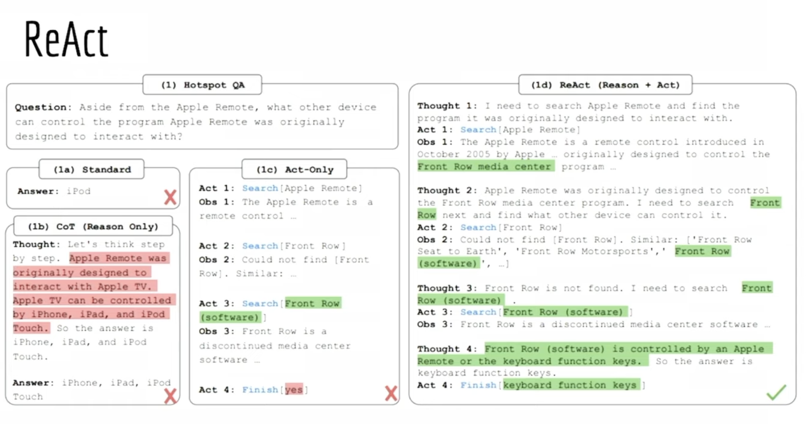
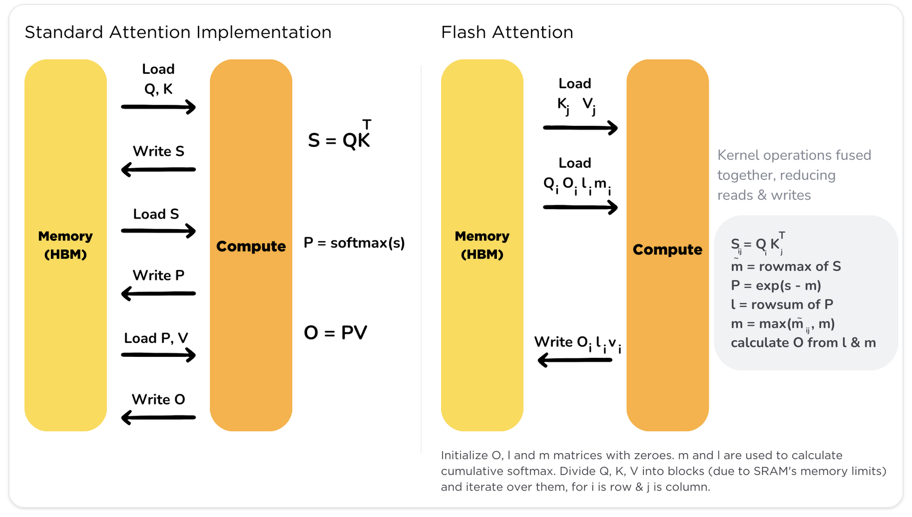
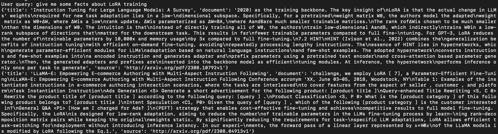
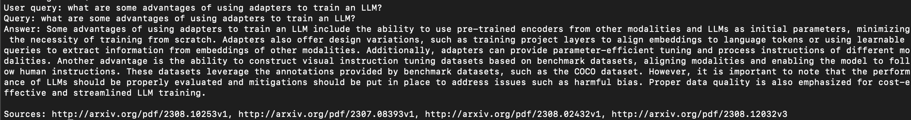
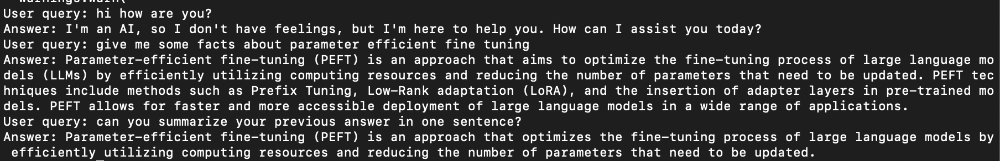

# RAG-ML
A repository to experiment with a specialized AI Assistant Chatbot for ML Research.

The field of AI is moving fast and it sometimes feels difficult to keep up with the latest research. Indeed, new papers come out at an increasingly fast pace, and some state-of-the-art results are ancient history no less than a month after their release. Benchmark results are being broken daily, and keeping up with the field can perhaps be a little overwhelming.

This Chatbot tool allows researchers or ML enthusiasts to be kept updated about the latest developments in the field of AI in general using the latest Chatbot technology. Indeed, one can simply query this Chatbot and ask questions about the latest benchmark results for a given task, or obtain explanations about some niche ML technique based on cutting-edge research papers, with sources. One can also use the Chatbot to select references for writing a research paper or creating a "related works" section.

As a start, this project aims to create a Database of ML research papers in NLP (Natural Language Processing), AI (Artificial Intelligence), ML (Machine Learning), CV (Computer Vision) and MA (Multiagent Systems). Papers are scraped from Arxiv, then embedded into a Pinecone Vector Database Index to be used as context into a RAG (Retrieval Augmented Generation) Chatbot System. The system can then produce answers to queries based on relevant context. Such a grounded system reduces LLM hallucination, provides relevant up-to-date answers with sources and is able to answer "I don't know" if the provided context is not sufficient.

Additionally, I implement a simple semantic search functionality and a RAG Agent that has the ability to search the Arxiv Knowledge Base and the internet for answers and extend the context knowledge to SERP results (blogs, news articles, etc.) as well as established alternative Knowledge Bases (eg. Wikipedia/Wkidata). I also implement a NeMo Guardrails Agent to add programmable guardrails to LLM-based conversational systems, allowing the Chatbot system to decide when and when not to use RAG to speed up generation.

Several RAG implementation are tested in this project:

- Naive RAG: A Semantic Similarity Search to retrieve relevant context is performed for every user query (slower).
- RAG Agent: An AI Agent decides when to use a Vector DB Similarity Search depending on the query (faster).
- RAG Agent with internet search: An AI Agent decides when to use an internet search to augment the context with relevant SERP results.
- NeMo Guardrails: an AI Agent is programmed with guardrails to define desirable behaviour when greeting the user, acceptable chat topics as well as canonical forms and utterances to speed up generation and provide relevant context from the Knowledge Base.
- FLARE RAG:
- RETRO:

The user can then query the Chatbot to retrieve specialized up-to-date content and provide answers with sources on specific ML topics.

### To Do

#### Arxiv Scraping
- [x] Setup Arxiv bot
- [x] Setup Asyncio Web scraping
- [x] Create master list of Arxiv papers
- [x] Remove duplicated papers

#### PDF text extraction
- [x] Parse PDFs to text with PyPDF2
- [x] Base content/references extraction
- [] Setup multithreading for PDF parsing
- [] LLM content/references extraction
- [x] Nougat markdown extraction

#### Synthetic QA Dataset Creation
- [x] Create synthetic QA dataset with gpt-3.5-turbo

#### Text preprocessing
- [x] Text tiling (chunking) with RecursiveCharacterTextSplitter
- [] Try different text tiling methods

#### ConversationalMemory
- [x] Setup Chatbot ConversationalMemory module
- [] Setup Chatbot CombinedMemory module

#### Pinecone Vector DB
- [x] Setup Pinecone Vector DB
- [x] Upsert document embeddings into Vector DB.
- [] Add paper submission date to docs for filtering

Use "dotproduct" as similarity metric for text-embedding-ada-002 model

#### RAG Chatbot
- [x] Setup Naive RAG Chatbot
- [x] Setup RAG Agent Chatbot
- [x] Setup RAG Guardrails (Nvidia) Chatbot
- [] Setup RAG FLARE Chatbot

#### Agent Tools
- [] Add InternetSearch tool
- [] Add chart captioning tool

#### Open-Source Implementation
- [] Setup LLama2 as LLM
- [] Setup sentence-transformers for document embeddings
- [] Tokenizer
- [] FAISS

#### LLM Fine-Tuning
- [x] Fine-Tune LLama2 (single-gpu accelerate) on ML document corpus with 4-bit QLoRA
- [x] Fine-Tune LLama2 (multi-gpu accelerate) on ML document corpus with 4-bit QLoRA
- [] Fine-Tune Llama2 on ML document QA dataset
- [] Fine-Tune Llama2 on chatbot interaction history
- [] Fine-Tune Llama2 on Alpaca dataset
- [] Setup Pytorch DDP training

#### Performance Evaluation
- [] Assess quality of RAG outputs with Ragas
- [] Assess quality of RAG outputs with LangSmith

#### GUI
- [] Setup streamlit GUI


## Ethical Considerations

	* RAG allows to ground LLM with facts, reduce hallucinations, be more truthful
	* Customize chatbot to given group of users
	* Open-Source LLM to control data, privacy, usage
	* Provides sources for fact-checking
	* Using Arxiv papers which are not yet peer reviewed
	* Constituional AI

## Arxiv Scraping
ML research papers are scraped from Arxiv in PDF format.

## Data Preprocessing

### PDF Extraction
The first version of the project extracted PDF content using PyPDF2. However, the quality of the extracted content was somewhat dubious at times. In a second step, I used Meta's nougat model ([paper](https://arxiv.org/abs/2308.13418), [repo](https://github.com/facebookresearch/nougat)) which is built for academic paper PDF extraction. The PDFs are extracted to markdown .mmd format then converted to .txt format. The high quality extraction allows to obtain excellent quality content and references for each paper compared to PyPDF2. I then use an LLM to structure the output to "content" and "references".

### Text Tiling

	* tiktoken(cl100k_base)

## Naive RAG

	* Using OpenAI API gpt-3.5-turbo
	* Using ada-002-embeddings
	* ConversationMemoryBuffer

	* When to query KB?
		- Can setup a similarity threshold if a retrieved context is below threshold don't include in context
		- Use retrieval tool with Agent

## ReAct RAG Agent
Agents use an LLM to determine which actions to take and in what order. An action can either be using a tool and observing its output, or returning a response to the user. Here, the LLM is used as a reasoning engine and is connected to other sources of data/knowledge: search, APIs, DBs, calculators, run code, etc.



### ReAct (Reasoning Acting): 
	- Challenge 1: Using tools in appropriate scenarios
	instructions, tool descriptions in prompt, tool retrieval, few-shot examples, fine tuned model (toolformer)
	- Challenge 2: Not using tools when not needed
	- Challenge 3: parsing LLM output to tool invocation (output parsers)
	- Challenge 4: Memory of previous reasoning steps (n most recent actions/observations combined with k most actions/observations)
	- Memory: remembering user-ai interactions, ai-tool interactions
	- Challenge 5: incorporate long observations (parse long output, store long output and do retrieval on it for next steps, eg. from API call)
	- Challengee 6: agent stays focused (reiterate objective, separate planning/execution step)
	- Evaluation: evaluate end result, intermediate steps (correct action, action input, sequence of steps, most efficient sequence of steps)

#### Other types of Agents:
	- AutoGPT: different objective than ReAct (initial goals for autogpt are open ended goals such as increase twitter following VS ReAct is short lived quantifiable goals) -> autogpt has long-term memory in agent-tool interactions through vectorstore
	- BabyAGI: long term memory of agent-tool interactions, has separate planning/execution steps
	- CAMEL: 2 agents in a simulation environment (chatroom), simulation good for evaluation
	- Generative Agents: 25 agents in "sims" simulated world, time/importance/relevancy-weighted memory, reflection step
	- HuggingGPT: task planner, connects AI models to solve AI tasks (ChatGPT selects models based on their huggingface description, executes subtasks and summarizes response)

## Guardrails RAG
Safety and topic guidance, deterministic dialogue, RAG, Conversational agents
For safety + faster RAG (Agent chooses to use retrieval KB tool if necessary, else answers queries fast)
Implement guardrails: user asks about unethical questions or chatbot outputs unaligned response. 

Previously: Adds safety and deterministic rules about topics -> agent will implement a security measure
Common discussions can be put on discussion "rails"

Now: Agent can also access tools

topics.co: define hardcoded behaviours (not necessary)

Canonical forms are defined (eg. define user ask weapon) and utterances are hardcoded (eg. how to make a dirty bomb) and embedded into vector space. User queries are also embedded into vector space. If the query is similar to utterances of a given canonical form, the user query activates a flow according to the closest canonical form (eg. "what is PEFT?" -> "user ask LLM training")

--> finetune LLM to generate topics.co canonical forms and utterances based on ML research papers.

colang: language built by nvidia to guide chatbot conversational flows

```
export OPENAI_API_KEY={OPENAI_API_KEY}
source ~/.zshrc
nemoguardrails chat --config=config/
```

--> nemo-guardrails-rag: faster than RAG Agent (one less LLM call)


You might run into certificate problems on an Apple Silicon machine. If so run the command below:
```
bash /Applications/Python*/Install\ Certificates.command
```
## FLARE RAG

## Open-Source Implementation
After prototype a base system with OpenAI ```gpt-3.5-turbo``` API, the goal is to implement an open-source RAG Chatbot, leveraging Llama-2 as the LLM and sentence-transformers as the vector embedding model. 

### Vector Embedding Fine-Tuning
A model such as ```text-embedding-ada-002``` trained on classic Information Retrieval datasets (eg. MSMarco, TREC, BeIR, MTEB) may not adapt well to out of domain text. It is thus of interest to investigate the performance of a custom embedding model trained on a specialized corpus.
--> Use fine-tuned LLM to generate synthetic training data.

### LLM Fine-Tuning
#### QLoRA
It is necessary to fine-tune the LLM to boost out-of-the-box performance. Experiments have shown that LLama-2 65B trained with [QLoRA](https://arxiv.org/abs/2305.14314) on the alpaca dataset achieves 99.3% of the performance level of ChatGPT. QLoRA (Quantization-Aware training) is a paradigm leveraging PEFT (LoRA) and quantization to train a model on a single GPU or multiple GPUs with limited memory. LoRA modifies the linear projection layers of self-attention blocks using low rank matrices which reduces number of trainable parameters while preserving the model parametric knowledge. The LLM weights are frozen quantized to 4-bit and only the LoRA adapter weights are finetuned in 16-bit. Other innovations such as the introdution of the ```nf4``` datatype, double quantization and page optimizers allow me to efficiently train ```LLama-2-7b``` in parallel on 4 Tesla-V100 GPUs in XX hours. For more details on the multi-GPU training implementation, see the [qlora-multi-gpu repo](https://github.com/ChrisHayduk/qlora-multi-gpu/tree/main) and [huggingface](https://huggingface.co/blog/pytorch-ddp-accelerate-transformers).

#### Causal Language Modelling (CLM)
The first fine-tuning round of ```LLama-2-7b``` consists of optimizing the loss on the CLM task (autoregressive method where the model is trained to predict the next token in a sequence given the previous token) with a corpus of ML documents (about 60'000, only the content section). Here I use 4-bit QLoRA training on 4 GPUs.

```
# with python3 (model parallelism, device_map="balanced)
python3 scripts/train_ddp.py
```

```
# with accelerate
accelerate config
accelerate launch --config_file /home/kieran/.cache/huggingface/accelerate/default_config.yaml --main_process_port 29501 scripts/train_ddp.py
```
#### QA finetuning
Here I finetune ```llama-2-7b``` on the scraped ML papers dataset, where I generate a question using OpenAI ```gpt-3.5-turbo``` based on a chunk of text from the papers. The goal is to produce a ML QA dataset for finetuning.

#### Conversation finetuning
Here I finetune ```llama-2-7b``` on a chatbot conversation dataset.

#### Alpaca finetuning
Here I finetune ```llama-2-7b``` on the Alpaca dataset (format: task instruction, input context, response) in the self-instruct style:

```
# alpaca example
"Below is an instruction that describes a task, paired with an input that provides further context. "
"Write a response that appropriately completes the request.\n\n"
"### Instruction:\n{instruction}\n\n### Input:\n{input}\n\n### Response: "
```

#### Toolformer finetuning
Here I finetune an LLM with [toolformer](https://arxiv.org/abs/2302.04761) using this [repo](https://github.com/lucidrains/toolformer-pytorch), to improve tool usage by the LLM.

### Latency Optimization
I try out several techniques to improve model inference latency while preserving generation quality.

#### Knowledge Distillation
Here I distill the finetuned LLM with [Knowledge Distillation](https://arxiv.org/abs/1503.02531). The idea is to train a small student model which learns to align its outputs on a larger teacher model, achieving similar performance at a much lower cost.

#### Post-Training Model Quantization
Here I quantize the finetuned distilled LLM using [GPTQ](https://arxiv.org/pdf/2210.17323.pdf)/GGML with the [huggingface implementation](https://huggingface.co/docs/transformers/main_classes/quantization).

#### Flash-Attention
I will implement [Flash-Attention](https://arxiv.org/abs/2205.14135) using this [repo](https://github.com/Dao-AILab/flash-attention). Attention has O(n^2) time and memory complexity. Traditionally, K, Q and V vectors are stored in High Bandwidth Memory (HBM) which is large in memory but slow in processing. Traditional attention implementation loads keys, queries, and values from HBM to GPU on-chip SRAM, performs a single step of the attention mechanism, writes it back to HBM, and repeats this for every single attention step. Flash-Attention loads the K, Q and V vectors once, fuses the operations of attention and writes them back to memory.



#### Other
I will implement [Multi-Query Attetion (MQA)](https://arxiv.org/abs/1911.02150), [Grouped-Query Attention (GQA)](https://arxiv.org/abs/2305.13245), [Rotary embeddings](https://arxiv.org/abs/2104.09864), [Alibi](https://arxiv.org/abs/2108.12409) and DeepSpeed to achieve lower latency on generation. I will also explore multiprocessing for inputs and model/data parallelism for inference.

	* MQA:
	* GQA:
	* Rotary Embeddings:
	* Alibi:
	* DeepSpeed: weights are moved to and from CPU to GPU depending on the required layers in the forward pass.

## Chatbot

### Conversational Memory
By default, Chains and Agents are stateless, meaning that they treat each incoming query independently. In some applications, it is highly important to remember previous interactions, both at a short term but also at a long term level. The concept of “Memory” exists to do exactly that. The final choice of conversational memory depends on the use case and predicted number of interactions. It is possible to combine different memory modules in the same chain.

--> use LLM to learn facts about user, create user profile, store information that can be retrieved

### ConversationBufferMemory:
 The conversation buffer memory keeps the previous pieces of conversation completely unmodified, in their raw form.

	* + Store maximum information
	* - Store all tokens -> slower response time and higher cost
	* - With gpt-3.5-turbo, once we hit 4096 input tokens the model cannot process queries

### ConversationSummaryMemory
The conversation summary memory keeps the previous pieces of conversation in a summarized form, where the summarization is performed by an LLM. The final history is shorter. This will enable us to have many more interactions before we reach our prompt's max length, making our chatbot more robust to longer conversations.
	
	* + Less token usage for long conversations
	* + Enables longer conversations
	* - Inefficient for shorter conversations
	* - Dependant on good summaries

### ConversationBufferWindowMemory
The ConversationBufferWindowMemory keeps a few of the last interactions in memory but intentionally drops the oldest ones. The window size is controlled with the k parameter. The conversation buffer window memory keeps the latest pieces of the conversation in raw form

	* + Less token usage
	* - Chatbot can forget previous interactions if k is set too low.

### ConversationSummaryBufferMemory
The conversation summary memory keeps a summary of the earliest pieces of conversation while retaining a raw recollection of the latest interactions.

	* + Define number of past tokens to keep in memory (keep raw information about recent interactions)
	* + Summarization of past interactions (remembers distant interactions)
	* - Increased token count for shorter conversations
	* - Summary quality is not guaranteed
	* - Summary + buffer uses more tokens

### ConversationKnowledgeGraphMemory
It is based on the concept of a knowledge graph which recognizes different entities and connects them in pairs with a predicate resulting in (subject, predicate, object) triplets. This enables us to compress a lot of information into highly significant snippets that can be fed into the model as context. The conversation knowledge graph memory keeps a knowledge graph of all the entities that have been mentioned in the interactions together with their semantic relationships.

### ConversationEntityMemory
The conversation entity memory keeps a recollection of the main entities that have been mentioned, together with their specific attributes.

## Performance Evaluation

	* Compare LLMS: OpenAI ChatGPT, Base LLama2 7b, Llama2 7b fine-tuned (4-bit quantization) (all with RAG)
	* Quantization of Llama2
	* Fine-Tuning: QLoRA, Batch size, gradient accumulation steps, gradient checkpointing, etc.
	* RLHF, RLAIF, ReST
	--> fine-tuning llama2 7b makes it as accurate as larger foundation model and faster to run

	* IR: retriever (eg. ColBERT) with ONNX: single-digit ms latency on B of tokens

	* Evaluate Memory modules: long, mid, short term
	* Evaluate Embedding models: ada-002, sentence-transformers
	* Evaluate context size

	* Use langsmith, ragas

	* IR datasets: TREC, MSMarco, BEIR
	* Recall@k, Precision@k, human eval
	* Engagement metrics
	* Multi-objective ranking
	* Query distribution (tail queries)

	* --> model retrieves exact match in relevant documents or ranks documents by relevancy

	* 1. Evaluate if context is sufficient to answer question
	* 2. Evaluate generation quality (hallucination)

## How to use
```
# create and activate virtualenv
python3 -m venv venv_rag
source venv_rag/bin/activate
```

Use the following CLI args:
	- ```s```: semantic search
	- ```q```: question answering
	- ```c```: chatbot
	- ```i```: pinecone index name
	- ```k```: k most similar docs to return from vector db
	- ```m```: maximum reasoning/actions steps to take
	- ```v```: verbosity of agent output

### Semantic Search
```
python3 naiveRAGbot.py -s -i rag-ml -k 2
```


### RAG Agent QA
```
python3 naiveRAGbot.py -q -i rag-ml -k 3
```


### RAG Agent Chatbot
```
python3 naiveRAGbot.py -c -i rag-ml -k 3 -m 3
```


### RAG guardrails Agent Chatbot